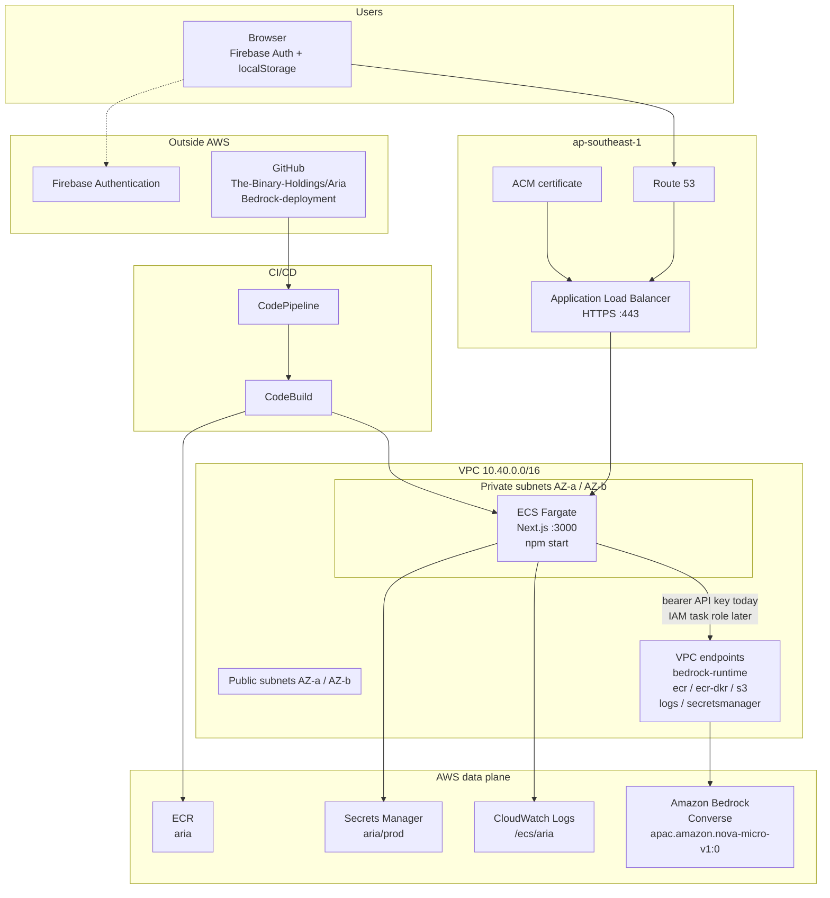
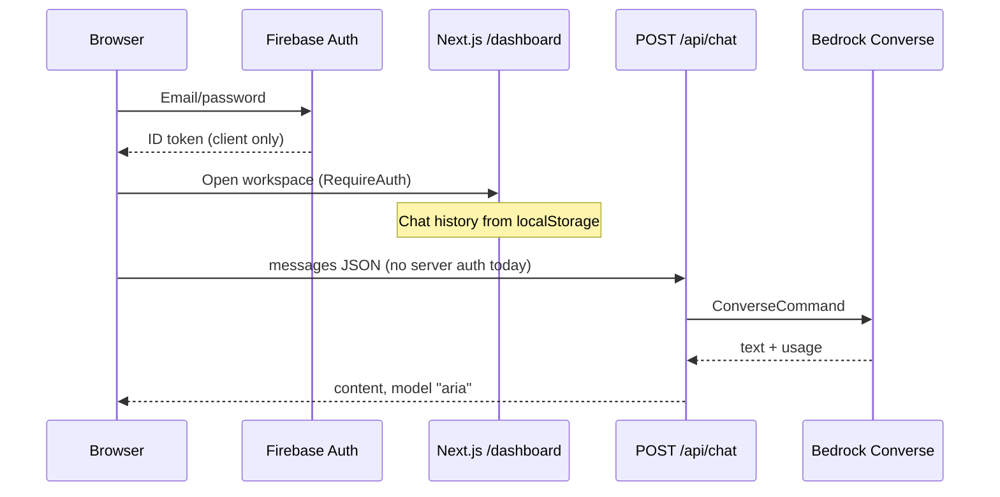

# ARIA AWS Deployment Report

| Field | Value |
| --- | --- |
| Repository | [The-Binary-Holdings/Aria](https://github.com/The-Binary-Holdings/Aria) |
| Branch inspected | `Bedrock-deployment` (HEAD `921d8c3`) |
| Remote | `https://github.com/The-Binary-Holdings/Aria.git` |
| Inspection date | 14 September 2026 |
| Recommended region | `ap-southeast-1` (matches Bedrock config in code) |
| Verdict | **Not container-deployable as-is.** Amplify SSR can host the current Next.js app after secrets are set. ECS/EKS/App Runner cannot until a container image and health check exist. |

This report is based on files in the working tree. Nothing below is inferred from a product pitch — only from what the repository actually contains.

---

## 1. Executive summary

ARIA is a **single Next.js 16 application** (marketing site + Firebase sign-in + authenticated chat workspace) that calls **Amazon Bedrock Converse** from one Node.js route: `app/api/chat/route.ts`.

There is **no application database**, **no queue**, **no object storage**, **no IaC**, **no Dockerfile**, and **no CI pipeline**. Workspace state (chats, users, plans, tokens) lives in **browser `localStorage`**. Firebase Admin env vars appear in `.env.example` but **are not referenced in TypeScript**. Live web search is **explicitly disabled**.

**Recommended production target:** **Amazon ECS on Fargate** behind an Application Load Balancer in `ap-southeast-1`, with images in ECR and secrets in Secrets Manager. That matches AWS Bedrock, long-running Node chat, and a future Aurora move.

**Fastest path to a public URL this week:** **AWS Amplify Hosting (SSR)** — no container required. Use this only for development/demo until the blockers in §11 are fixed.

**Do not use** EKS (no services to orchestrate), Lambda (Node chat + Bedrock latency + no OpenNext adapter in repo), or raw EC2 (undifferentiated ops).

---

## 2. Repository structure (evidence)

Inspected top-level (14 Sep 2026):

```
Aria/
├── AGENTS.md, CLAUDE.md, README.md
├── .env.example, .gitignore
├── app/                    Next.js App Router
├── components/
├── lib/aria, lib/auth, lib/data
├── next.config.ts
├── package.json, package-lock.json
├── eslint.config.mjs, postcss.config.mjs, tsconfig.json
└── (no Dockerfile, no infra/, no .github/workflows)
```

### Application routes

| Path | File | Role |
| --- | --- | --- |
| `/` | `app/(marketing)/page.tsx` | Marketing home |
| `/features`, `/pricing` | `app/(marketing)/features/page.tsx`, `pricing/page.tsx` | Product pages |
| `/blog`, `/docs`, `/changelog`, `/contact` | `app/(marketing)/…` | Static marketing content from `lib/data/` |
| `/sign-in` | `app/sign-in/page.tsx` | Firebase email/password |
| `/dashboard` | `app/dashboard/page.tsx` | Chat workspace (`RequireAuth` + `AriaShell`) |
| `/dashboard/plans`, `/users`, `/profile`, `/usage` | `app/dashboard/*/page.tsx` | Client-only account UI |
| `POST /api/chat` | `app/api/chat/route.ts` | **Only API route.** Bedrock Converse. `runtime = "nodejs"`. |

No `middleware.ts`. No `app/api/health`. No other `app/api/**` routes.

---

## 3. Application analysis

### 3.1 Application type

| Item | Finding | Evidence |
| --- | --- | --- |
| Framework | Next.js **16.3.0** App Router | `package.json` |
| UI | React **19.2.8** | `package.json` |
| Language | TypeScript (strict) | `tsconfig.json` |
| CSS | Tailwind CSS v4 | `postcss.config.mjs`, `app/globals.css` |
| Package manager | npm (`package-lock.json` present) | repo root |
| Monorepo | **No.** Single app | `package.json` `"name": "aria"` |

`README.md` line 4: *“This repository is a single Next.js application.”*

### 3.2 Runtime requirements

| Requirement | Evidence |
| --- | --- |
| Node.js **>= 20** | `package.json` → `"engines": { "node": ">=20" }` |
| Server runtime for chat | `export const runtime = "nodejs"` in `app/api/chat/route.ts` |
| Listen port | `3000` — `npm run start` → `next start --port 3000` |
| Next config | Empty object — `next.config.ts` has **no** `output: "standalone"` |
| Fonts at build | `next/font/google` Geist + Newsreader in `app/layout.tsx` — build needs outbound HTTPS to Google Fonts |

### 3.3 Build process

From `package.json` scripts and `README.md`:

```bash
npm ci                 # lockfile install (production CI)
npm run lint           # eslint
npm run typecheck      # tsc --noEmit
npm run build          # next build
npm run start          # next start --port 3000
```

No test script. **Zero** `*.test.ts` / `*.spec.ts` files in the repository.

### 3.4 Environment variables

#### Read by application code

| Variable | Where read | Required |
| --- | --- | --- |
| `NEXT_PUBLIC_FIREBASE_API_KEY` | `lib/auth/client.ts` | Yes (sign-in throws if missing) |
| `NEXT_PUBLIC_FIREBASE_AUTH_DOMAIN` | `lib/auth/client.ts` | Yes |
| `NEXT_PUBLIC_FIREBASE_PROJECT_ID` | `lib/auth/client.ts` | Yes |
| `NEXT_PUBLIC_FIREBASE_STORAGE_BUCKET` | `lib/auth/client.ts` | Yes (config object; Storage SDK not used) |
| `NEXT_PUBLIC_FIREBASE_MESSAGING_SENDER_ID` | `lib/auth/client.ts` | Yes |
| `NEXT_PUBLIC_FIREBASE_APP_ID` | `lib/auth/client.ts` | Yes |
| `BEDROCK_API_KEY` | `lib/aria/model/config.ts` → `requireApiKey()` | Yes for chat |
| `AWS_BEARER_TOKEN_BEDROCK` | Fallback in `config.ts`; also **set at runtime** in `lib/aria/model/client.ts` | Alternate to API key |
| `BEDROCK_REGION` | `config.ts` `getRegion()` | Optional; default `ap-southeast-1` |
| `AWS_REGION` | Fallback in `getRegion()` | Optional |
| `BEDROCK_MODEL_ID` | `config.ts` `getModelName()` | Optional; default `apac.amazon.nova-micro-v1:0` |
| `BEDROCK_MODEL` | Fallback model id | Optional |
| `BEDROCK_ENABLE_SEARCH` | `config.ts` `isLiveSearchEnabled()` | Optional; treated as off unless `1`/`true`/`on` |

#### Present in `.env.example` but **not referenced in any `.ts` / `.tsx` file**

| Variable | Status |
| --- | --- |
| `FIREBASE_PROJECT_ID` | Dead. No `firebase-admin` package in `package.json`. |
| `FIREBASE_CLIENT_EMAIL` | Dead. |
| `FIREBASE_PRIVATE_KEY` | Dead. |
| `FIREBASE_PRIVATE_KEY_ID` | Dead. |
| `FIREBASE_CLIENT_ID` | Dead. |
| `FIREBASE_CLIENT_X509_CERT_URL` | Dead. |
| `NEXT_PUBLIC_WEB_URL` | Dead. |
| `ARIA_PUBLIC_URL` | Dead. |
| `ARIA_EMBED_SECRET` | Dead. |
| `ARIA_FRAME_ANCESTORS` | Dead. No CSP headers in `next.config.ts`. |

Do **not** put unused Admin keys in production Secrets Manager unless you add Firebase Admin first.

### 3.5 Database dependencies

**None.**

Grep across application TypeScript found no Prisma, Drizzle, Postgres, Mongo, Redis, SQLite, or Firestore client usage. `@firebase/firestore` exists only as a **transitive** dependency of `firebase` in `package-lock.json`; the app never imports it.

Persistence in use:

| Data | Storage | File |
| --- | --- | --- |
| Conversations | `localStorage` key `aria.workspace.conversations.v2` | `lib/aria/conversations.ts` |
| Workspace users / roles | `localStorage` `aria.workspace.users.v1` | `lib/aria/users.ts` |
| Profile | `localStorage` | `lib/aria/profile.ts` |
| Settings / theme | `localStorage` `aria.workspace.settings.v1` | `lib/aria/settings.ts`, `app/layout.tsx` |
| Plan selection | `localStorage` | `lib/aria/plans.ts` |
| Token usage | `localStorage` `aria.workspace.token-usage.v1` | `lib/aria/tokens.ts` |
| Cookie banner | `localStorage` `aria-cookies-accepted` | `components/layout/CookieBanner.tsx` |

### 3.6 External services

| Service | Used? | Evidence |
| --- | --- | --- |
| Firebase Authentication (email/password) | **Yes** | `lib/auth/auth-provider.tsx` — `signInWithEmailAndPassword`, `onAuthStateChanged` |
| Firebase Admin | **No** | Not in `package.json` dependencies |
| Firebase Storage / Firestore | **No** | Config fields only |
| Amazon Bedrock Runtime (Converse) | **Yes** | `lib/aria/model/client.ts` — `BedrockRuntimeClient`, `ConverseCommand` |
| Live web search (Tavily/Brave/Google) | **No** | `lib/aria/model/search.ts` comments; `BEDROCK_ENABLE_SEARCH=false` in `.env.example`; `resolveSearchStatus()` never returns `"used"` |
| Payment / Stripe | **No** | Plans are static in `lib/aria/plans.ts` |
| Email / contact backend | **No** | `app/(marketing)/contact/page.tsx` is static |

### 3.7 AWS Bedrock integration (actual)

File: `lib/aria/model/client.ts`

- SDK: `@aws-sdk/client-bedrock-runtime` `^3.1124.0` (`package.json`)
- Auth: **Bedrock API key as HTTP bearer token**, not the default IAM credential chain:

```ts
process.env.AWS_BEARER_TOKEN_BEDROCK = apiKey;
cachedClient = new BedrockRuntimeClient({
  region,
  authSchemePreference: ["httpBearerAuth"],
  token: { token: apiKey },
});
```

- API: `ConverseCommand` with `system: [{ text: buildSystemPrompt(...) }]`, `inferenceConfig` temperature `0.75`, topP `0.95`, maxTokens `2048` (`lib/aria/model/config.ts`)
- Default model: `apac.amazon.nova-micro-v1:0` (APAC inference profile)
- Default region: `ap-southeast-1`
- Client response hides vendor: API returns `model: "aria"` (`app/api/chat/route.ts`)

**Implication for IAM:** today’s code does **not** need `bedrock:InvokeModel` on the task role if `BEDROCK_API_KEY` is injected. Best practice is still to **retire the long-lived API key** and use a task role (see §7 and §12).

### 3.8 Authentication

| Layer | Behaviour | File |
| --- | --- | --- |
| Client | Firebase email/password | `lib/auth/auth-provider.tsx` |
| Dashboard gate | Client redirect if no user | `components/chat/RequireAuth.tsx` |
| Server session | **None.** No cookies, no JWT verify | — |
| `POST /api/chat` | **Unauthenticated.** Accepts any JSON body | `app/api/chat/route.ts` |

This is a **production security blocker**. Anyone who can reach the origin can burn Bedrock quota.

### 3.9 Storage services

No S3, EFS, or CloudFront origin in code. Composer attachments are stored as `dataUrl` on messages and persisted in `localStorage` (`lib/aria/conversations.ts` quota fallback strips data URLs).

### 3.10 Queues / background jobs

None. No SQS, EventBridge, cron routes, or worker processes.

---

## 4. Deployment-related files (inventory)

| Artifact | Present? | Path |
| --- | --- | --- |
| Dockerfile | **Missing** | — |
| docker-compose.yml | **Missing** | — |
| buildspec.yml | **Missing** | — |
| `.github/workflows` | **Missing** | — |
| ECS task definition | **Missing** | — |
| EKS / Helm / k8s manifests | **Missing** | — |
| Terraform | **Missing** | — |
| AWS CDK | **Missing** | — |
| CloudFormation | **Missing** | — |
| Amplify (`amplify.yml`) | **Missing** | — |
| `appspec.yml` | **Missing** | — |
| `.vercel` | Ignored only | `.gitignore` line 38 |
| Health check route | **Missing** | — |
| `output: "standalone"` | **Missing** | `next.config.ts` is `{}` |

The repository is an application codebase, not a platform codebase.

---

## 5. Recommended AWS architecture

### Decision (task 6)

| Option | Verdict | Why (from this repo) |
| --- | --- | --- |
| **ECS Fargate** | **Recommended production** | Long-lived Node process (`runtime = "nodejs"`), Bedrock in the same AWS account, Secrets Manager, ALB idle timeout for Converse, no k8s skill needed |
| **AWS Amplify Hosting** | **OK for dev/demo only** | Native Next.js SSR; no Dockerfile required. Weaker VPC/IAM story for Bedrock; still exposes unauthenticated `/api/chat` |
| **App Runner** | Acceptable alternative | Simpler than ECS once a Dockerfile exists; less networking control |
| **EKS** | Reject | Single process, no manifests, ops cost unjustified |
| **EC2** | Reject | Manual patching; no Autoscaling/IaC in repo |
| **Lambda** | Reject | No OpenNext/SST adapter; `/api/chat` is Node + Bedrock (seconds, not milliseconds); empty `next.config.ts` is not Lambda-ready |

### Target architecture (ECS Fargate)

- **Region:** `ap-southeast-1` (same as `DEFAULT_REGION` and `.env.example`)
- **Compute:** ECS Fargate service, 2 tasks across 2 AZs
- **Image:** ECR
- **Ingress:** ALB (HTTPS) → target group port 3000 → Next.js
- **Secrets:** Secrets Manager → task definition `secrets`
- **Bedrock:** Interface VPC endpoint `com.amazonaws.ap-southeast-1.bedrock-runtime` so private tasks do not need a NAT Gateway for Converse
- **Auth:** Firebase Auth remains outside AWS (Google SaaS)
- **CDN (optional):** CloudFront in front of ALB for marketing static assets
- **Observability:** CloudWatch Logs + Container Insights + ALB access logs on S3

Aurora is **not** in the first production cut. The app has nothing to connect.

### Architecture diagram (Mermaid)





---

## 6. Infrastructure requirements

### 6.1 AWS services

| Service | Purpose |
| --- | --- |
| ECS + Fargate | Run Next.js |
| ECR | Image registry |
| ELB (ALB) | HTTPS termination, health checks |
| VPC + 2 AZs | Isolation |
| Secrets Manager | `BEDROCK_API_KEY` and Firebase public config if you refuse to bake `NEXT_PUBLIC_*` |
| CloudWatch Logs / Metrics | App + ALB |
| CodeBuild + CodePipeline | CI/CD from GitHub |
| ACM + Route 53 | TLS + DNS |
| Bedrock | Model inference (already used) |
| IAM | Task, execution, and pipeline roles |
| (Optional) CloudFront | CDN |
| (Optional later) Aurora PostgreSQL | Only after you add a data layer — **not now** |
| (Optional later) WAF | Rate-limit `/api/chat` |

### 6.2 IAM permissions

**ECS task execution role** (pull image, inject secrets):

- `ecr:GetAuthorizationToken`, `ecr:BatchGetImage`, `ecr:GetDownloadUrlForLayer`
- `logs:CreateLogStream`, `logs:PutLogEvents`
- `secretsmanager:GetSecretValue` on `arn:aws:secretsmanager:ap-southeast-1:<account>:secret:aria/*`

**ECS task role (application)** — current code (API key):

- No Bedrock IAM actions required if `BEDROCK_API_KEY` is present.

**ECS task role — recommended migration** (drop API key):

```json
{
  "Version": "2012-10-17",
  "Statement": [
    {
      "Sid": "InvokeNovaMicro",
      "Effect": "Allow",
      "Action": ["bedrock:InvokeModel", "bedrock:InvokeModelWithResponseStream"],
      "Resource": [
        "arn:aws:bedrock:ap-southeast-1:<account>:inference-profile/apac.amazon.nova-micro-v1:0",
        "arn:aws:bedrock:*::foundation-model/amazon.nova-micro-v1"
      ]
    }
  ]
}
```

Then change `lib/aria/model/client.ts` to construct `BedrockRuntimeClient({ region })` **without** `token` / `httpBearerAuth`, and rely on the task role. That change is **not** in the repo today.

**CodeBuild role:**

- ECR push, CloudWatch Logs, `codebuild:BatchGet*`
- (If using CodePipeline deploy) `ecs:UpdateService`, `ecs:DescribeServices`, `iam:PassRole`

**CodePipeline role:** GitHub (CodeStar Connections), CodeBuild, ECS deploy.

### 6.3 Networking and VPC

Suggested CIDR (example only — pick unused space):

| Item | Recommendation |
| --- | --- |
| VPC | `10.40.0.0/16`, DNS hostnames on |
| Public subnets | `10.40.0.0/24`, `10.40.1.0/24` — ALB only |
| Private subnets | `10.40.10.0/24`, `10.40.11.0/24` — Fargate |
| Internet Gateway | Yes (ALB) |
| NAT Gateway | **Avoid for prod v1** if VPC endpoints cover ECR, S3, Logs, Secrets, Bedrock Runtime |
| VPC endpoints | `bedrock-runtime` (interface), `ecr.api`, `ecr.dkr`, `s3` (gateway), `logs`, `secretsmanager` |

Outbound from tasks: 443 to Bedrock, Firebase is **browser-side** (users talk to `*.firebaseapp.com` / Google, not the ECS task).

### 6.4 Security groups

**ALB SG (`sg-aria-alb`)**

- Inbound: `443` from `0.0.0.0/0` (and `80` → redirect to 443)
- Outbound: `3000` to ECS SG

**ECS SG (`sg-aria-ecs`)**

- Inbound: `3000` **only** from ALB SG
- Outbound: `443` to `0.0.0.0/0` or to prefix lists for VPC endpoints

### 6.5 Secrets Manager

Create one JSON secret per environment, e.g. `aria/prod`:

```json
{
  "BEDROCK_API_KEY": "<rotate — do not commit>",
  "BEDROCK_REGION": "ap-southeast-1",
  "BEDROCK_MODEL_ID": "apac.amazon.nova-micro-v1:0",
  "BEDROCK_ENABLE_SEARCH": "false"
}
```

`NEXT_PUBLIC_FIREBASE_*` are compiled into the **browser bundle at `next build`**. They must be present as **CodeBuild environment variables at build time**, not only as runtime secrets. Secrets Manager at task start is too late for `NEXT_PUBLIC_*`.

### 6.6 CloudWatch

| Log group | Source |
| --- | --- |
| `/ecs/aria-prod` | Fargate `awslogs` driver |
| `/aws/codebuild/aria` | Builds |
| ALB access logs | S3 bucket `aria-alb-logs-<account>` |

Application already logs failures with `console.error("[api/chat]", error)` in `app/api/chat/route.ts`. That becomes CloudWatch stdout.

Alarms:

- ALB `HTTPCode_Target_5XX_Count` > 5 in 5 minutes
- ALB `UnHealthyHostCount` > 0
- ECS CPU > 70% / memory > 80%
- (After IAM Bedrock) CloudWatch metric filter on `"ThrottlingException"`

### 6.7 Auto-scaling

Chat is bursty but the process is stateless (server holds no session).

| Env | Tasks | CPU / memory | Autoscaling |
| --- | --- | --- | --- |
| Development | 1 | 256 CPU / 512 MB | Off |
| Staging | 1–2 | 256 / 512 | Target CPU 70% |
| Production | **min 2** | 512 CPU / 1024 MB | Target CPU 60%, max 6 |

ALB target-group health: `GET /api/health` (must be added — see §11). Grace period 60s (Next.js cold start).

ALB idle timeout: **60–120 seconds** so Bedrock Converse is not cut off.

---

## 7. Database / Aurora analysis

### Compatibility

**Aurora PostgreSQL is not used and is not required to deploy this branch.**

There is no ORM, no `DATABASE_URL`, no migrations folder, and no SQL.

Plans in `lib/aria/plans.ts` (`free` / `pro` / `business` / `enterprise`) are **UI constants**, not billing records.

### If you add Aurora later (not implemented)

Only then would you introduce schemas. A future design that matches **existing TypeScript types** (not invented product features):

| Table | Maps to |
| --- | --- |
| `workspace_users` | `WorkspaceUser` in `lib/aria/users.ts` |
| `conversations` / `messages` | `Conversation` / `ChatMessage` in `lib/aria/types.ts` |
| `profiles` | `lib/aria/profile.ts` |
| `settings` | `lib/aria/settings.ts` |
| `token_usage` | `lib/aria/tokens.ts` |

**Migration process today:** none. No Prisma/Drizzle. Adding Aurora means a new project (schema + API routes + replace `localStorage` helpers).

**Connection string format (future only):**

```
postgresql://aria_app:<password>@aria-prod.cluster-xxxx.ap-southeast-1.rds.amazonaws.com:5432/aria
```

**Initialization steps today:** N/A.

**Do not provision Aurora** for this release. It adds ~$50–150/month and unused attack surface.

---

## 8. Generated CI/CD and container artifacts

These files are **not in the repository**. Use the following as the implementation spec.

### 8.1 `next.config.ts` change (required for Docker)

```ts
import type { NextConfig } from "next";

const nextConfig: NextConfig = {
  output: "standalone",
};

export default nextConfig;
```

### 8.2 `Dockerfile` (recommended)

```dockerfile
# syntax=docker/dockerfile:1
FROM node:20-alpine AS deps
WORKDIR /app
COPY package.json package-lock.json ./
RUN npm ci

FROM node:20-alpine AS builder
WORKDIR /app
COPY --from=deps /app/node_modules ./node_modules
COPY . .
# NEXT_PUBLIC_* must be present here
ARG NEXT_PUBLIC_FIREBASE_API_KEY
ARG NEXT_PUBLIC_FIREBASE_AUTH_DOMAIN
ARG NEXT_PUBLIC_FIREBASE_PROJECT_ID
ARG NEXT_PUBLIC_FIREBASE_STORAGE_BUCKET
ARG NEXT_PUBLIC_FIREBASE_MESSAGING_SENDER_ID
ARG NEXT_PUBLIC_FIREBASE_APP_ID
ENV NEXT_PUBLIC_FIREBASE_API_KEY=$NEXT_PUBLIC_FIREBASE_API_KEY
ENV NEXT_PUBLIC_FIREBASE_AUTH_DOMAIN=$NEXT_PUBLIC_FIREBASE_AUTH_DOMAIN
ENV NEXT_PUBLIC_FIREBASE_PROJECT_ID=$NEXT_PUBLIC_FIREBASE_PROJECT_ID
ENV NEXT_PUBLIC_FIREBASE_STORAGE_BUCKET=$NEXT_PUBLIC_FIREBASE_STORAGE_BUCKET
ENV NEXT_PUBLIC_FIREBASE_MESSAGING_SENDER_ID=$NEXT_PUBLIC_FIREBASE_MESSAGING_SENDER_ID
ENV NEXT_PUBLIC_FIREBASE_APP_ID=$NEXT_PUBLIC_FIREBASE_APP_ID
ENV NEXT_TELEMETRY_DISABLED=1
RUN npm run build

FROM node:20-alpine AS runner
WORKDIR /app
ENV NODE_ENV=production
ENV PORT=3000
ENV HOSTNAME=0.0.0.0
RUN addgroup -S nextjs && adduser -S nextjs -G nextjs
COPY --from=builder /app/public ./public
COPY --from=builder --chown=nextjs:nextjs /app/.next/standalone ./
COPY --from=builder --chown=nextjs:nextjs /app/.next/static ./.next/static
USER nextjs
EXPOSE 3000
CMD ["node", "server.js"]
```

Note: there is **no `public/` directory** in the repo today (only `app/favicon.ico`). Create an empty `public/.gitkeep` or drop the `COPY public` line if the folder is absent.

### 8.3 `.dockerignore`

```
node_modules
.next
.git
.env
.env.*
!.env.example
ARIA_AWS_DEPLOYMENT_REPORT.md
```

### 8.4 Health route to add: `app/api/health/route.ts`

```ts
import { NextResponse } from "next/server";

export const runtime = "nodejs";

export function GET() {
  return NextResponse.json({ ok: true, service: "aria" });
}
```

ALB should use this path. Do **not** call Bedrock from the health check.

### 8.5 `buildspec.yml` (CodeBuild)

```yaml
version: 0.2

env:
  variables:
    AWS_DEFAULT_REGION: ap-southeast-1
    IMAGE_REPO_NAME: aria
    CONTAINER_NAME: aria
  parameter-store: {}
  secrets-manager:
    NEXT_PUBLIC_FIREBASE_API_KEY: aria/build:NEXT_PUBLIC_FIREBASE_API_KEY
    NEXT_PUBLIC_FIREBASE_AUTH_DOMAIN: aria/build:NEXT_PUBLIC_FIREBASE_AUTH_DOMAIN
    NEXT_PUBLIC_FIREBASE_PROJECT_ID: aria/build:NEXT_PUBLIC_FIREBASE_PROJECT_ID
    NEXT_PUBLIC_FIREBASE_STORAGE_BUCKET: aria/build:NEXT_PUBLIC_FIREBASE_STORAGE_BUCKET
    NEXT_PUBLIC_FIREBASE_MESSAGING_SENDER_ID: aria/build:NEXT_PUBLIC_FIREBASE_MESSAGING_SENDER_ID
    NEXT_PUBLIC_FIREBASE_APP_ID: aria/build:NEXT_PUBLIC_FIREBASE_APP_ID

phases:
  pre_build:
    commands:
      - echo Logging in to Amazon ECR
      - aws ecr get-login-password --region $AWS_DEFAULT_REGION | docker login --username AWS --password-stdin $AWS_ACCOUNT_ID.dkr.ecr.$AWS_DEFAULT_REGION.amazonaws.com
      - COMMIT_HASH=$(echo $CODEBUILD_RESOLVED_SOURCE_VERSION | cut -c 1-7)
      - IMAGE_TAG=${COMMIT_HASH:-latest}
      - REPO_URI=$AWS_ACCOUNT_ID.dkr.ecr.$AWS_DEFAULT_REGION.amazonaws.com/$IMAGE_REPO_NAME
  build:
    commands:
      - npm ci
      - npm run typecheck
      - npm run lint
      - docker build
          --build-arg NEXT_PUBLIC_FIREBASE_API_KEY=$NEXT_PUBLIC_FIREBASE_API_KEY
          --build-arg NEXT_PUBLIC_FIREBASE_AUTH_DOMAIN=$NEXT_PUBLIC_FIREBASE_AUTH_DOMAIN
          --build-arg NEXT_PUBLIC_FIREBASE_PROJECT_ID=$NEXT_PUBLIC_FIREBASE_PROJECT_ID
          --build-arg NEXT_PUBLIC_FIREBASE_STORAGE_BUCKET=$NEXT_PUBLIC_FIREBASE_STORAGE_BUCKET
          --build-arg NEXT_PUBLIC_FIREBASE_MESSAGING_SENDER_ID=$NEXT_PUBLIC_FIREBASE_MESSAGING_SENDER_ID
          --build-arg NEXT_PUBLIC_FIREBASE_APP_ID=$NEXT_PUBLIC_FIREBASE_APP_ID
          -t $REPO_URI:$IMAGE_TAG
          -t $REPO_URI:latest
          .
  post_build:
    commands:
      - docker push $REPO_URI:$IMAGE_TAG
      - docker push $REPO_URI:latest
      - printf '[{"name":"%s","imageUri":"%s"}]' $CONTAINER_NAME $REPO_URI:$IMAGE_TAG > imagedefinitions.json

artifacts:
  files:
    - imagedefinitions.json
```

Set `AWS_ACCOUNT_ID` as a CodeBuild environment variable.

### 8.6 CodePipeline (Console / conceptual stages)

1. **Source** — CodeStar Connections → GitHub `The-Binary-Holdings/Aria` branch `Bedrock-deployment` (or `main` after merge).
2. **Build** — CodeBuild project `aria-build` using `buildspec.yml`, privileged mode (**Docker-in-Docker required**).
3. **Deploy** — Amazon ECS → cluster `aria-prod` → service `aria-web` → image definitions file `imagedefinitions.json`.

Pipeline artifact store: S3 `aria-pipeline-artifacts-<account>-ap-southeast-1` (block public access).

### 8.7 ECS task definition

```json
{
  "family": "aria-prod",
  "networkMode": "awsvpc",
  "requiresCompatibilities": ["FARGATE"],
  "cpu": "512",
  "memory": "1024",
  "executionRoleArn": "arn:aws:iam::<account>:role/aria-ecs-execution",
  "taskRoleArn": "arn:aws:iam::<account>:role/aria-ecs-task",
  "containerDefinitions": [
    {
      "name": "aria",
      "image": "<account>.dkr.ecr.ap-southeast-1.amazonaws.com/aria:latest",
      "essential": true,
      "portMappings": [{ "containerPort": 3000, "protocol": "tcp" }],
      "environment": [
        { "name": "NODE_ENV", "value": "production" },
        { "name": "PORT", "value": "3000" },
        { "name": "BEDROCK_REGION", "value": "ap-southeast-1" },
        { "name": "BEDROCK_MODEL_ID", "value": "apac.amazon.nova-micro-v1:0" },
        { "name": "BEDROCK_ENABLE_SEARCH", "value": "false" }
      ],
      "secrets": [
        {
          "name": "BEDROCK_API_KEY",
          "valueFrom": "arn:aws:secretsmanager:ap-southeast-1:<account>:secret:aria/prod:BEDROCK_API_KEY::"
        }
      ],
      "logConfiguration": {
        "logDriver": "awslogs",
        "options": {
          "awslogs-group": "/ecs/aria-prod",
          "awslogs-region": "ap-southeast-1",
          "awslogs-stream-prefix": "aria"
        }
      },
      "healthCheck": {
        "command": ["CMD-SHELL", "wget -qO- http://127.0.0.1:3000/api/health || exit 1"],
        "interval": 30,
        "timeout": 5,
        "retries": 3,
        "startPeriod": 40
      }
    }
  ]
}
```

Alpine images need `wget` (busybox) or switch the health command to `node -e` fetching `/api/health`.

### 8.8 ECR setup (AWS Console)

1. Console → **Elastic Container Registry** → region **Asia Pacific (Singapore) `ap-southeast-1`**.
2. **Create repository** → name `aria` → tag immutability **Disabled** (pipeline retags `latest`) → scan on push **Enabled** → encryption AES-256.
3. Note URI: `<account>.dkr.ecr.ap-southeast-1.amazonaws.com/aria`.
4. Local smoke (after Dockerfile exists):

```bash
aws ecr get-login-password --region ap-southeast-1 \
  | docker login --username AWS --password-stdin <account>.dkr.ecr.ap-southeast-1.amazonaws.com
docker build -t aria:local .
docker tag aria:local <account>.dkr.ecr.ap-southeast-1.amazonaws.com/aria:dev
docker push <account>.dkr.ecr.ap-southeast-1.amazonaws.com/aria:dev
```

### 8.9 Environment variable configuration by stage

| Variable | Dev | Staging | Production | When injected |
| --- | --- | --- | --- | --- |
| `NEXT_PUBLIC_FIREBASE_*` (6 keys) | Firebase **dev** project | Firebase **staging** project or same as prod with test users | Firebase **prod** project | **Build** |
| `BEDROCK_API_KEY` | Dev key / low quota | Staging key | Rotated prod key | **Runtime** secret |
| `BEDROCK_REGION` | `ap-southeast-1` | same | same | Runtime env |
| `BEDROCK_MODEL_ID` | `apac.amazon.nova-micro-v1:0` | same | same | Runtime env |
| `BEDROCK_ENABLE_SEARCH` | `false` | `false` | `false` | Runtime env |
| Unused `FIREBASE_*` Admin / `ARIA_*` | Omit | Omit | Omit | — |

---

## 9. Environment checklists

### Development

- [ ] Node 20+ locally (`package.json` engines)
- [ ] `cp .env.example .env` and fill Firebase + `BEDROCK_API_KEY`
- [ ] `npm install && npm run dev` → `http://localhost:3000`
- [ ] Sign-in works (`lib/auth/client.ts` throws if Firebase public vars missing)
- [ ] `POST /api/chat` returns ARIA copy, not vendor errors (`lib/aria/public-errors.ts`)
- [ ] Confirm Bedrock key is valid (expired keys were observed in local testing; customers must not see that text)
- [ ] Do not commit `.env` (`.gitignore` `.env*`)

### Staging (Amplify **or** 1-task Fargate)

- [ ] Separate Firebase project or clearly labelled test users
- [ ] Secrets in Secrets Manager `aria/staging` (or Amplify env)
- [ ] Custom domain optional (`staging.example.com`)
- [ ] ALB/Amplify URL restricted (IP allow list or HTTP basic) — `/api/chat` is open
- [ ] CloudWatch log group created
- [ ] Destroy/recycle keys used in chat or Slack

### Production

- [ ] Dockerfile + `output: "standalone"` + `/api/health` merged
- [ ] **Server-side auth on `/api/chat`** (Firebase Admin `verifyIdToken`) — not in repo today
- [ ] WAF rate limit on `/api/chat`
- [ ] ECS min 2 tasks, 2 AZs
- [ ] ACM certificate + HTTPS redirect
- [ ] Secrets rotation runbook for Bedrock API key (or IAM task role)
- [ ] Container Insights + 5xx alarm + on-call
- [ ] Backup story: **none for chat data** (localStorage). Communicate that to customers
- [ ] Authorized model access in Bedrock console for `apac.amazon.nova-micro-v1:0` in `ap-southeast-1`

---

## 10. Is the repository currently deployable?

| Target | Deployable now? | Reason |
| --- | --- | --- |
| Local `npm run build && npm start` | **Yes**, with `.env` | Documented in `README.md` |
| AWS Amplify SSR | **Mostly yes** | No `amplify.yml` needed for default Next.js; must set env vars in Console |
| App Runner | **No** | No Dockerfile |
| ECS Fargate | **No** | No image, no standalone output, no health check |
| EKS | **No** | No manifests |
| Lambda | **No** | No adapter |
| Aurora | **N/A** | No database layer |

### Blockers and fixes

| # | Blocker | Evidence | Fix |
| --- | --- | --- | --- |
| B1 | No container image | No `Dockerfile` | Add §8.2 Dockerfile |
| B2 | Next.js not standalone | `next.config.ts` is `{}` | Set `output: "standalone"` |
| B3 | No health check | No `app/api/health` | Add §8.4; ALB cannot safely drain |
| B4 | `/api/chat` is public | `app/api/chat/route.ts` has no auth | Add Firebase Admin, verify `Authorization: Bearer <idToken>` |
| B5 | Firebase Admin listed but unused | `.env.example` vs no `firebase-admin` dep | Either implement Admin verify or delete those env vars |
| B6 | Bedrock long-lived API key | `lib/aria/model/client.ts` bearer token | Prefer task-role IAM; rotate keys that were pasted in chat |
| B7 | No CI | No `.github/workflows`, no `buildspec.yml` | Add CodePipeline as in §8 |
| B8 | Dead embed/CSP env | `ARIA_FRAME_ANCESTORS` unused | Implement headers in `next.config.ts` or remove from example |
| B9 | No tests | No test files | Add at least a route/unit test before prod pipeline gates |
| B10 | Search advertised in prompts historically, still off | `search.ts`, `.env.example` | Keep `BEDROCK_ENABLE_SEARCH=false` until a tool exists |
| B11 | Chat state not multi-device | `localStorage` in `conversations.ts` | Accept for v1 or add Aurora later |
| B12 | Google Fonts at build | `app/layout.tsx` | CodeBuild needs egress to `fonts.googleapis.com` / `fonts.gstatic.com` |

Until **B1–B4** are done, do not call this production-ready for paying customers.

---

## 11. Security recommendations

1. **Authenticate `/api/chat`.** Highest priority. Client `RequireAuth` is bypassable (`components/chat/RequireAuth.tsx` is UI-only).
2. **Never return Bedrock/AWS errors to browsers.** Already mapped in `lib/aria/public-errors.ts` and `app/api/chat/route.ts`. Keep it that way.
3. **Do not ship model IDs to the client.** API already returns `"aria"`.
4. **Secrets:** only `BEDROCK_API_KEY` in Secrets Manager. Rotate any key that appeared in developer chat or a committed screenshot.
5. **Task role over API keys** when you can change `client.ts`.
6. **WAF:** rate limit `POST /api/chat` (e.g. 20 req/min/IP) — this route is the spend valve.
7. **Security groups:** tasks not on `0.0.0.0/0:3000`.
8. **Do not enable `BEDROCK_ENABLE_SEARCH`** until a reviewed search vendor exists (`lib/aria/model/search.ts`).
9. **Firebase authorized domains:** add the production hostname in Firebase Console (Auth → Settings → Authorized domains).
10. **Ignore unused Admin private keys** until the Admin SDK is added — a leaked unused key is still a credential.
11. **Container:** non-root user (Dockerfile `USER nextjs`).
12. **Image scanning** on ECR push.

---

## 12. Cost estimate (ap-southeast-1, order of magnitude)

Figures are **indicative 2026 list pricing**, not a quote. Bedrock tokens dominate if chat is busy.

| Item | Dev | Staging | Production (steady) |
| --- | --- | --- | --- |
| Amplify Hosting (alternative) | ~$0–5 + build minutes | ~$5–20 | ~$20–80 + bandwidth |
| ECS Fargate 512/1024, 2 tasks 24/7 | — | ~$15 | ~$30–40 |
| ALB | — | ~$18 | ~$18 + LCU |
| NAT Gateway (if you skip VPC endpoints) | — | ~$35 + data | ~$35–70 |
| VPC endpoints (interface × ~5) | — | ~$35 | ~$35 |
| ECR + logs | ~$2 | ~$5 | ~$10–25 |
| Secrets Manager (1–2 secrets) | <$1 | <$1 | <$2 |
| CodePipeline + CodeBuild | ~$1–5 | ~$5–15 | ~$10–30 |
| **Bedrock Nova Micro** | Pay per token | Pay per token | **Largest variable.** 2k max tokens/reply (`config.ts`) |
| Aurora (if wrongly provisioned) | — | — | **+$50–150 — do not add** |

**Lean prod (recommended):** Fargate + ALB + VPC endpoints + no NAT + no Aurora ≈ **USD 80–140/month** before Bedrock usage.

**Expensive mistake:** NAT + Aurora + EKS for this repo.

---

## 13. Step-by-step deployment procedure

### Path A — Amplify (demo this week)

1. AWS Console → region **ap-southeast-1** → **Amplify** → **Create new app** → **GitHub** → `The-Binary-Holdings/Aria` → branch `Bedrock-deployment`.
2. App type: **Hosting** (Next.js SSR). Build: `npm ci && npm run build`. Start: Amplify default (do not use a custom Dockerfile).
3. **Environment variables** → add all six `NEXT_PUBLIC_FIREBASE_*` plus `BEDROCK_API_KEY`, `BEDROCK_REGION`, `BEDROCK_MODEL_ID`, `BEDROCK_ENABLE_SEARCH=false`.
4. Save and deploy. Open the Amplify URL.
5. Firebase Console → Authentication → Authorized domains → add `*.amplifyapp.com` and your custom domain.
6. Smoke: `/` marketing, `/sign-in`, `/dashboard` chat.
7. Treat as **non-production** until B4 (API auth) is shipped.

### Path B — ECS Fargate (production target)

**Prerequisites in the repo (merge first):** Dockerfile, standalone output, `/api/health`, (strongly) `/api/chat` auth.

1. **ECR** — §8.8.
2. **Secrets Manager** — Create `aria/prod` and `aria/build` (Firebase public keys for CodeBuild).
3. **VPC** — VPC wizard: 2 AZs, public + private. Create endpoints listed in §6.3.
4. **Security groups** — §6.4.
5. **CloudWatch** — Log group `/ecs/aria-prod`.
6. **IAM** — Execution role + task role (§6.2).
7. **ECS cluster** — Console → ECS → Clusters → Create → Fargate → name `aria-prod`.
8. **Task definition** — Create → Fargate → paste §8.7 (fix ARNs).
9. **ALB** — Internet-facing, HTTPS 443, ACM cert, target group IP mode, port 3000, health `GET /api/health`, matcher 200, idle timeout 120s. Listener 80 → 443.
10. **ECS service** — Launch type Fargate, desired 2, private subnets, ECS SG, attach ALB target group, circuit breaker **on**, public IP **off**.
11. **Route 53** — Alias A record → ALB.
12. **CodeBuild** — Privileged, Node 20 + Docker image `aws/codebuild/standard:7.0` or `amazonlinux2-x86_64-standard:5.0`, env `AWS_ACCOUNT_ID`, attach `buildspec.yml`.
13. **CodePipeline** — Source GitHub `Bedrock-deployment` → Build → Deploy ECS.
14. **Firebase authorized domains** — production hostname.
15. **Bedrock console** — Confirm model access for Nova Micro / APAC profile in `ap-southeast-1`.
16. **Verify** — `curl -I https://<domain>/api/health` → 200; sign-in; one chat; confirm CloudWatch `[api/chat]` only on failures; confirm customers never see “Bedrock” or “Nova”.

### AWS Console: enable Bedrock model access

1. Console → **Amazon Bedrock** → region **ap-southeast-1**.
2. **Model access** → enable **Amazon Nova Micro** / inference profile `apac.amazon.nova-micro-v1:0`.
3. **API keys** (current app) → generate a key, store in Secrets Manager, never in git.
4. Or skip keys and use IAM on the task role after `client.ts` is changed.

---

## 14. Deployment strategy (summary)

| Phase | What | Success |
| --- | --- | --- |
| 0 | Merge Docker + health + (auth) | `docker run` locally on :3000 |
| 1 | Amplify or single-task ECS staging | Chat works with staging secrets |
| 2 | Prod ECS 2 AZ + pipeline from `Bedrock-deployment` or `main` | Green pipeline, `/api/health`, HTTPS |
| 3 | IAM Bedrock + WAF + (optional) Aurora | No API keys in the task; `/api/chat` authenticated |

Keep **compute in `ap-southeast-1`**. The model id `apac.amazon.nova-micro-v1:0` is an APAC inference profile; running the app in `us-east-1` would add latency and confuse IAM resource ARNs.

---

## 15. File-path index of findings

| Finding | Path |
| --- | --- |
| App name, scripts, Node 20, Bedrock SDK, Firebase SDK | `package.json` |
| Env template | `.env.example` |
| Empty Next config | `next.config.ts` |
| Chat API, Node runtime, no auth | `app/api/chat/route.ts` |
| Bedrock Converse + bearer key | `lib/aria/model/client.ts` |
| Model/region defaults | `lib/aria/model/config.ts` |
| Search not wired | `lib/aria/model/search.ts` |
| Customer-safe errors | `lib/aria/public-errors.ts` |
| Firebase client config | `lib/auth/client.ts` |
| Email/password auth | `lib/auth/auth-provider.tsx` |
| Client-only route guard | `components/chat/RequireAuth.tsx` |
| localStorage conversations | `lib/aria/conversations.ts` |
| localStorage users | `lib/aria/users.ts` |
| Product narrative | `README.md` |
| Secrets ignored | `.gitignore` |
| No workflows | (missing) `.github/workflows/` |
| No container | (missing) `Dockerfile` |

---

## 16. Sign-off

ARIA on `Bedrock-deployment` is a **stateless Next.js 16 + Firebase Auth + Bedrock Converse** app. It is **locally runnable** and **Amplify-hostable**, but it is **not an AWS production platform** until you add a container contract, a health endpoint, and server-side chat authentication.

**Do not add Aurora, EKS, or Lambda** to “complete” this design. They do not match the codebase that exists today.

---

*Prepared from a full-tree inspection of The-Binary-Holdings/Aria @ `Bedrock-deployment`. No credentials from `.env` are included in this document.*
